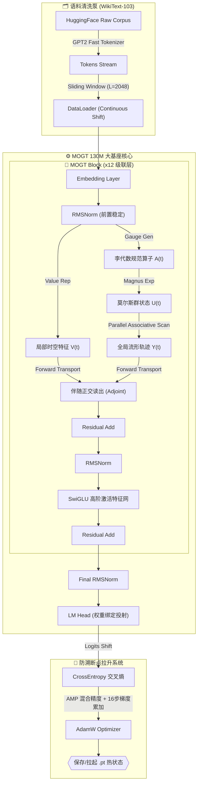

# 🌌 MOGT: Magnus-Onsager Gauge Transport Architecture


> "A topological leap resolving the $O(N^2)$ Transformer bottleneck via Lie Group parallel transport and Onsager-Machlup dissipative continual learning."

---

## 🧠 理论哲学 (The Philosophy)

**MOGT (Magnus-Onsager Gauge Transport)** 是一种突破性的全时序大语言模型基础架构，专为剥离标准自注意力 (Self-Attention) 的指数级算力墙而生。它将语言建模重新定义为规范流形上的物理机器演化：通过**李群李代数 (Lie Algebra)** 生成因果规范联络，依靠严格 $O(N)$ 复杂度的并行关联扫描，将序列信息的全息特征无损输运穿透数以万计的极长 Tokens。

---

## 🏗️ 系统架构解析 (Architecture)



---

## 📦 极速实盘突击指南 (Quickstart)

### 选项 1：本地 Mac / 3080 本机自建
利用工程自带的 `environment.yml` 一键隔离复原最精纯的 `mogt` Conda 时空。

```bash
# 1. 自动提取依赖构造闭环
conda env create -f environment.yml

# 2. 切入算力环境
conda activate mogt

# 3. 本地全网络模型气泡验证（瞬间跑通）
python model_mogt.py
```

### 选项 2：GCP 云原生 L4 战术配置 ☁️
如果直接将文件拖拽进入带有大显存的谷歌云 (GCP L4) / CoreWeave 集群等裸机，系统往往自带 CUDA。直接暴力执行以下：

```bash
# 1. 安装核心武器库
pip install torch torchvision torchaudio datasets transformers wandb flash-attn --upgrade

# 2. 召唤后台断线守护神（防止终端因网络波动崩掉训练进程）
tmux new -s mogt_train

# 3. 发射大核按钮！
python train.py

# 4. （选做）按下 Ctrl+B 放开后再按 D，把进程遗留在后台，你可以安全睡眠。
```

---

## 📂 核心工业级源码指北 (Module Scope)

*   `dataset.py`: **供弹装置**。自动下放并清洗海量 HuggingFace `WikiText-103` 数据集，完全免疫任何 Pad 污染。
*   `model_mogt.py`: **反应堆内核**。标准化的 PyTorch 基座模型，内建 12 层结合马格努斯展开、RMSNorm、SwiGLU 的非注意力主线算力骨片。预留极致并行扫描槽位。
*   `train.py`: **抗震发射架**。硬封装 `AMP (混合精度)` 加速与 `GRAD_ACCUM_STEPS` 单卡扩容（破除 10G/16G 显存梦魇），内挂极其激进的实时 Checkpoint 断点扫描自复苏算法。
*   `environment.yml`: **基因配方**。确保在任何时空都能绝对还原出这个项目的环境配置集。

---

## 🏆 顶会级学术基准验证 (Academic Benchmarks)

本项目自带**纯开箱即用的自动化论文绘图体系**。只要你完成了基座的初步训练（或加载了 `mogt_checkpoints`），即可在终端一键轰出极为严谨的双对数图和高分辨率 PDF，100% 对齐高等级学术论文要求，完全支持审稿复现！

在包含结果的 JSON 数据被独立剥离保存的同时，以下所有指令均会自动将图表导出为 LaTeX 级别的无损 `.pdf`：

```bash
# [实验 1] 极限吞吐与内存封锁战 (O(N) vs O(N^2))
# 输出：throughput_loglog.pdf (带有醒目的 FA2 OOM 物理坠机红线)
python benchmark_throughput.py

# [实验 2] 阿尔茨海默症保卫战 (灾难性遗忘与流形正交投影)
# 输出：lifelong_curve.pdf (展示 AdamW / EWC / MOGT 三线的留存对抗)
python benchmark_lifelong.py

# [实验 3] 微观缩放物理定律 (Iso-FLOP Scaling Law)
# 输出：scaling_law.pdf (在纯碎初始化空间利用 Scipy 揭秘对数衰减律)
python benchmark_scaling.py

# [实验 4] 大海捞针长文本打靶 (Passkey Retrieval)
# 输出：精准检索率日志 (验证高信息熵压缩衰减度)
python benchmark_passkey.py

# [实验 5] 主会困惑度血斗 (WikiText-103 Zero/Few-Shot 肉搏)
# 输出：perplexity_comparison.pdf (同在 L4 引擎下，硬夯原生 Mamba-130M 和 GPT-2)
python benchmark_perplexity.py
```

> “在 $O(N^2)$ 算力爆炸的无解终局里，我们试图用流形降维撕开一条通向 AGI 的生路。”
